# User Workspaces Server - System Architecture Diagram

```mermaid
graph TB
    %% External Components
    Client[Client Applications]
    Globus[Globus API]
    PSCU[PSC API Users]
    LDAP[LDAP Server]
    SLURM[SLURM Cluster]
    
    %% Load Balancer/Proxy
    NGINX[NGINX Reverse Proxy]
    
    %% Django Application Layer
    subgraph "Django Application Layer"
        DJANGO[Django Web Server<br/>user_workspaces_server]
        ASGI[ASGI/WebSocket Handler]
        
        subgraph "Views/API Layer"
            WS_VIEW[Workspace Views]
            JOB_VIEW[Job Views]
            USER_VIEW[User Views]
            TOKEN_VIEW[Token Views]
            STATUS_VIEW[Status Views]
            PT_VIEW[Passthrough Views]
            SWS_VIEW[Shared Workspace Views]
        end
        
        subgraph "Controllers"
            subgraph "Authentication Methods"
                GLOBUS_AUTH[Globus User Auth]
                PSC_AUTH[PSC API User Auth]
                LOCAL_AUTH[Local User Auth]
                ABSTRACT_AUTH[Abstract User Auth]
            end
            
            subgraph "Storage Methods"
                LOCAL_STORAGE[Local FileSystem Storage]
                HUBMAP_STORAGE[HubMAP Local FileSystem Storage]
                ABSTRACT_STORAGE[Abstract Storage]
            end
            
            subgraph "Resources"
                LOCAL_RESOURCE[Local Resource]
                SLURM_RESOURCE[SLURM API Resource]
                ABSTRACT_RESOURCE[Abstract Resource]
            end
            
            subgraph "Job Types"
                JUPYTER_JOB[Jupyter Lab Job]
                LOCAL_TEST_JOB[Local Test Job]
                ABSTRACT_JOB[Abstract Job]
            end
        end
        
        subgraph "Core Django Components"
            MODELS[Django Models<br/>- Workspace<br/>- Job<br/>- UserQuota<br/>- ExternalUserMapping<br/>- SharedWorkspaceMapping]
            AUTH_SYSTEM[Custom Authentication<br/>UserWorkspacesTokenAuthentication]
            SERIALIZERS[DRF Serializers]
            TASKS[Django-Q Background Tasks]
        end
    end
    
    %% Data Layer
    subgraph "Data & Cache Layer"
        POSTGRES[(PostgreSQL Database)]
        REDIS[(Redis Cache/Queue)]
    end
    
    %% Monitoring
    subgraph "Monitoring & Logging"
        GRAFANA[Grafana Dashboard]
        EMAIL_LOG[Email Logging<br/>AsyncEmailHandler]
    end
    
    %% File System
    FILESYSTEM[File System<br/>Workspaces & Data Storage]
    
    %% Connections
    Client --> NGINX
    NGINX --> DJANGO
    NGINX --> ASGI
    
    %% API Views to Controllers
    WS_VIEW --> LOCAL_STORAGE
    WS_VIEW --> HUBMAP_STORAGE
    JOB_VIEW --> LOCAL_RESOURCE
    JOB_VIEW --> SLURM_RESOURCE
    JOB_VIEW --> JUPYTER_JOB
    JOB_VIEW --> LOCAL_TEST_JOB
    
    %% Authentication Flow
    TOKEN_VIEW --> GLOBUS_AUTH
    TOKEN_VIEW --> PSC_AUTH
    TOKEN_VIEW --> LOCAL_AUTH
    AUTH_SYSTEM --> TOKEN_VIEW
    
    %% External Integrations
    GLOBUS_AUTH --> Globus
    PSC_AUTH --> PSCU
    PSC_AUTH --> LDAP
    SLURM_RESOURCE --> SLURM
    
    %% Data Persistence
    DJANGO --> POSTGRES
    DJANGO --> REDIS
    TASKS --> REDIS
    
    %% Storage Integration
    LOCAL_STORAGE --> FILESYSTEM
    HUBMAP_STORAGE --> FILESYSTEM
    
    %% Monitoring
    DJANGO --> EMAIL_LOG
    GRAFANA --> POSTGRES
    
    %% WebSocket Connections
    ASGI --> REDIS
    
    %% Styling
    classDef external fill:#ffebcd,stroke:#8b4513,stroke-width:2px
    classDef django fill:#e1f5fe,stroke:#0277bd,stroke-width:2px
    classDef data fill:#f3e5f5,stroke:#7b1fa2,stroke-width:2px
    classDef controller fill:#e8f5e8,stroke:#2e7d32,stroke-width:2px
    classDef monitoring fill:#fff3e0,stroke:#f57c00,stroke-width:2px
    
    class Client,Globus,PSCU,LDAP,SLURM external
    class DJANGO,ASGI,WS_VIEW,JOB_VIEW,USER_VIEW,TOKEN_VIEW,STATUS_VIEW,PT_VIEW,SWS_VIEW,MODELS,AUTH_SYSTEM,SERIALIZERS,TASKS django
    class POSTGRES,REDIS,FILESYSTEM data
    class GLOBUS_AUTH,PSC_AUTH,LOCAL_AUTH,LOCAL_STORAGE,HUBMAP_STORAGE,LOCAL_RESOURCE,SLURM_RESOURCE,JUPYTER_JOB,LOCAL_TEST_JOB controller
    class GRAFANA,EMAIL_LOG monitoring
```

## Architecture Overview

### Core Components

**Django Application Layer:**
- **Django Web Server**: Main application built with Django 5.1.3 and Django REST Framework
- **ASGI/WebSocket Handler**: Handles real-time WebSocket connections using Django Channels
- **Views/API Layer**: RESTful API endpoints for workspace, job, user, and authentication management

**Controller Pattern:**
- **Authentication Methods**: Pluggable authentication supporting Globus, PSC API, and local users
- **Storage Methods**: Abstracted storage layer supporting local filesystem and HubMAP-specific storage
- **Resources**: Compute resource management for local and SLURM-based execution
- **Job Types**: Extensible job execution system supporting Jupyter Lab and custom job types

**Data Layer:**
- **PostgreSQL**: Primary database for persistent data storage
- **Redis**: Used for caching, WebSocket channel layer, and Django-Q task queue
- **File System**: Workspace data and file storage

### Key Features

1. **Multi-tenant Workspace Management**: Users can create, manage, and share workspaces
2. **Job Execution**: Support for launching interactive sessions and batch jobs
3. **Pluggable Authentication**: Support for multiple authentication providers
4. **Resource Management**: User quotas and resource allocation tracking
5. **Real-time Updates**: WebSocket support for live status updates
6. **Background Processing**: Asynchronous task processing with Django-Q

### API Endpoints

The system provides REST API endpoints for:
- User authentication and token management (`/tokens/`)
- Workspace CRUD operations (`/workspaces/`)
- Job management and monitoring (`/jobs/`)
- User management (`/users/`)
- System status (`/status/`)
- Shared workspace functionality

### Deployment Architecture

**Docker Compose Setup:**
- **NGINX**: Reverse proxy and load balancer
- **Django Web Application**: Main application server
- **PostgreSQL**: Database service
- **Redis**: Cache and message broker
- **Grafana**: Monitoring and metrics dashboard

### Security Features

- Custom token-based authentication (`UWS-Authorization` header)
- CORS support for cross-origin requests
- LDAP integration for enterprise authentication
- User quota management and resource limits